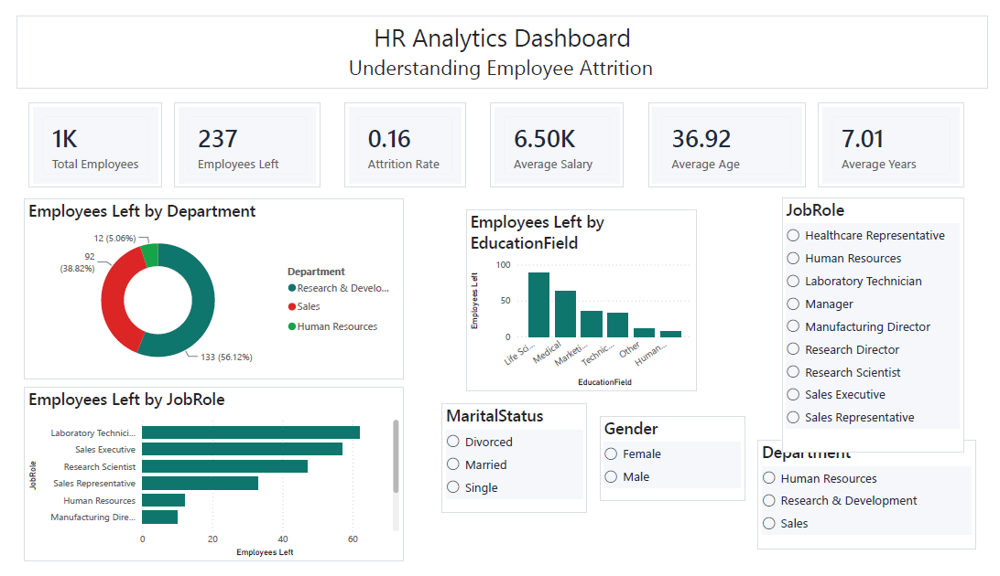
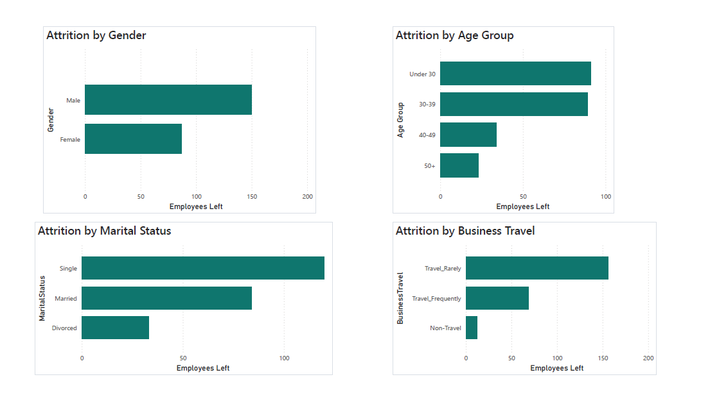
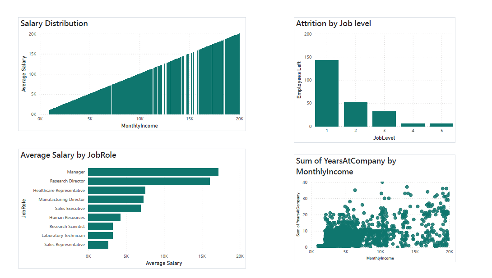
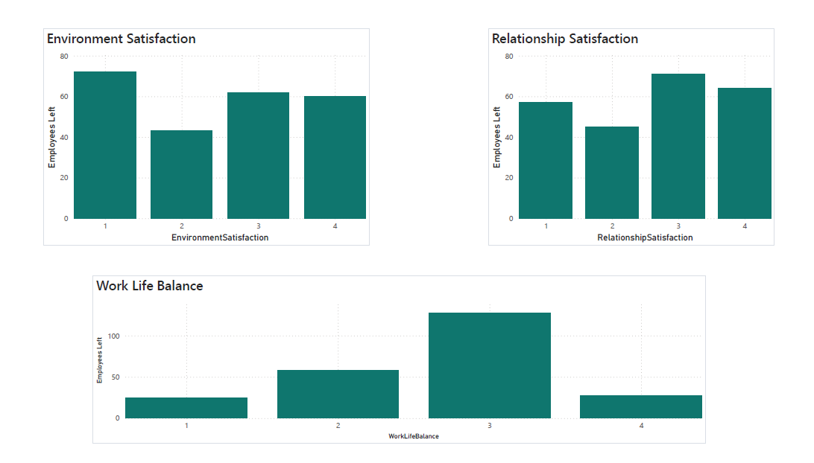
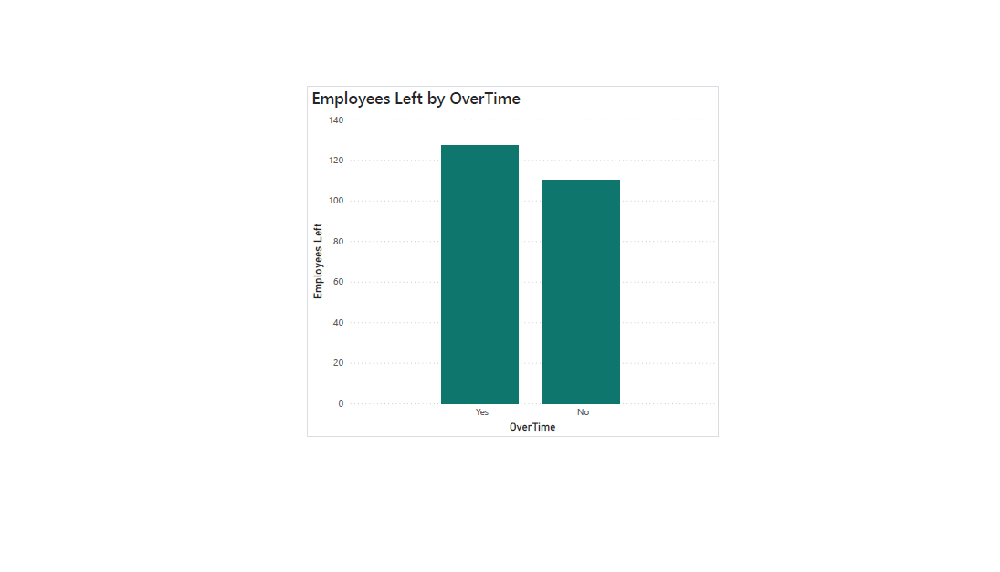

# HR Analytics Dashboard

## Business Problem

The HR Director observed increasing employee attrition and wanted to understand the factors contributing to employee turnover.

This project analyzes workforce demographics, compensation, job satisfaction, promotions, and overtime to identify the primary drivers of attrition and provide actionable recommendations.

---

## Tools Used

- Power BI
- DAX
- Power Query
- Excel

---

## Dashboard Pages

### Executive Overview

- Total Employees
- Attrition Rate
- Average Salary
- Average Age
- Department Overview

---

### Attrition Analysis

- Attrition by Department
- Job Role
- Gender
- Business Travel

---

### Salary & Career Growth

- Salary Distribution
- Salary by Job Role
- Promotion Analysis
- Years at Company

---

### Job Satisfaction

- Job Satisfaction
- Environment Satisfaction
- Work-Life Balance
- Overtime Analysis

---

## Key Insights

- Employees working overtime have significantly higher attrition.
- Early-career employees are more likely to leave.
- Lack of promotions correlates with higher employee turnover.
- Sales and Research departments experience higher attrition than other functions.
- Lower salary groups exhibit higher resignation rates.

---

## Business Recommendations

- Reduce excessive overtime through workload planning.
- Improve career progression and promotion opportunities.
- Review compensation for lower salary bands.
- Introduce targeted retention initiatives for high-risk departments.
- Strengthen onboarding and mentorship for new employees.

---

## Files Included

- HR Analytics Dashboard (.pbix)
- Employee Attrition Dataset (.csv)
- Custom Power BI Theme (.json)